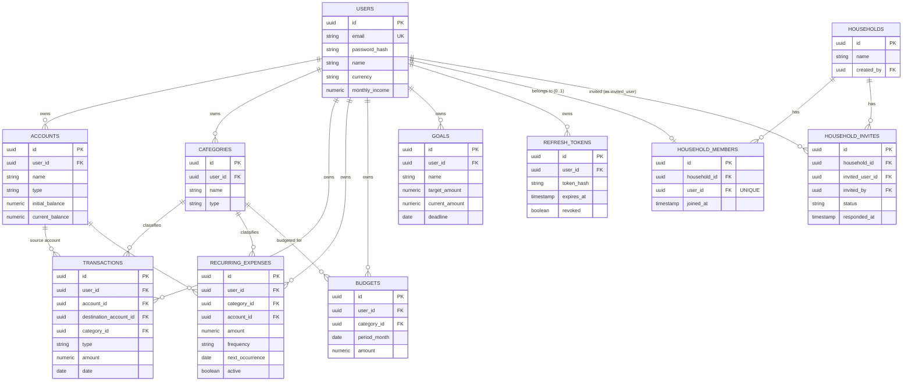

# CentiSible — Arquitetura, Requisitos, Modelo de Dados e Roadmap

> Documento vivo. Atualizar conforme o projeto evolui e decisões mudam.

## 1. Visão geral da arquitetura

CentiSible é um **monólito modular**: um único backend FastAPI organizado em camadas claras, e um frontend React SPA separado que consome a API via REST/JSON. Sem microservices, sem message broker — a complexidade do domínio (dinheiro, orçamentos, recorrências) já é suficiente para aprender arquitetura sem precisar de distribuição.

```
┌─────────────────┐        HTTPS/JSON        ┌──────────────────────┐
│  React SPA       │ ───────────────────────▶ │  FastAPI (backend)   │
│  (Vite, TS)       │ ◀─────────────────────── │  Modular monolith     │
└─────────────────┘                          └──────────┬───────────┘
                                                          │ SQLAlchemy 2.x
                                                          ▼
                                               ┌──────────────────────┐
                                               │     PostgreSQL        │
                                               └──────────────────────┘
```

Camadas do backend (dependências apontam sempre para baixo):

```
api/          → routers FastAPI, dependency injection, HTTP concerns
schemas/      → Pydantic models (request/response), validação
services/     → regras de negócio (business logic), orquestração
repositories/ → acesso a dados (queries SQLAlchemy), sem lógica de negócio
models/       → SQLAlchemy ORM models (tabelas)
db/           → engine, session, base declarativa
core/         → config, security (JWT/hashing), exceptions
```

Regra: um router nunca fala diretamente com a base de dados. Um router chama um service; um service usa um ou mais repositories; um repository só sabe fazer queries, não decide regras de negócio (ex: "uma transferência não conta como despesa" vive no service, não no repository).

### Backend

- **FastAPI** — API assíncrona, validação automática via Pydantic, OpenAPI grátis.
- **SQLAlchemy 2.x** (estilo `Mapped[]`/`mapped_column`) — ORM moderno, type-safe.
- **Alembic** — migrations versionadas.
- **Pydantic v2** — schemas de validação/serialização.
- **PostgreSQL** — porquê (ver secção 14).

### Frontend

- **React + TypeScript + Vite** — SPA moderna, build rápido.
- **React Router** — routing client-side.
- **TanStack Query** — cache/estado de servidor (evita reinventar loading/error/refetch).
- **React Hook Form + Zod** — formulários performantes + validação partilhável de schema.
- **Tailwind CSS** — estilização utilitária, rápida para UI consistente.
- **shadcn/ui** — componentes (botão, card, modal, input, tabs, dropdown...) baseados em Radix UI + Tailwind, copiados para dentro do próprio código do projeto (não é uma dependência de runtime como uma UI kit tradicional). Dá um aspeto profissional tipo dashboard SaaS rapidamente, mantendo controlo total sobre o código de cada componente — importante para conseguir explicar cada peça na defesa.
- **Framer Motion (`motion`)** — animações declarativas: transições de página, entrada de cards/listas, números a contar no dashboard, hover/tap states. Standard de facto em React para este tipo de polish visual.
- **Recharts** — gráficos (despesas por categoria, evolução mensal, progresso de orçamentos/objetivos). Biblioteca de gráficos React mais usada no mercado, animações incluídas por defeito, API simples de justificar numa entrevista.

### Porquê não usar as tecnologias excluídas agora

Redis: sem necessidade de cache distribuído/sessions partilhadas a esta escala. Kubernetes/microservices/Kafka: overkill para uma app de um único utilizador por vez, sem picos de tráfego reais. GraphQL: REST é suficiente e mais didático para os fundamentos de HTTP. Todas ficam como possíveis "extensões futuras" documentadas no roadmap.

---

## 2. Requisitos funcionais (resumo)

| Área | Requisito |
|---|---|
| Auth | Registo, login, logout, refresh token, rotas protegidas |
| Users | Perfil com nome, moeda, rendimento mensal |
| Accounts | CRUD de contas financeiras, saldo atual calculado |
| Categories | CRUD de categorias próprias do utilizador; bloqueio de eliminação se houver transações associadas |
| Transactions | CRUD; tipos INCOME/EXPENSE/TRANSFER; transferências não contam como despesa |
| Recurring Expenses | CRUD; frequência MONTHLY/YEARLY; geração de transações (mecanismo simples) |
| Budgets | Orçamento mensal por categoria; cálculo automático de gasto/restante/% |
| Goals | Objetivos com target/current/deadline; projeção de conclusão |
| Dashboard | Resumo financeiro do mês selecionado + gráfico de despesas por categoria |
| Monthly History | Navegação entre meses + comparação com mês anterior |
| Insights | Regras simples sobre variações, % de orçamento usado, projeções |
| Households | Criar agregado familiar; convidar outro utilizador (por email) para o agregado; aceitar/recusar convite; alternar dashboard entre vista "Individual" e vista "Agregado Familiar" (soma de contas/transações/saldos de todos os membros) |

## 3. Requisitos não funcionais

- **Segurança**: nunca expor dados de outro utilizador; passwords com hash forte; secrets fora do código; CORS restrito.
- **Correção financeira**: nenhum cálculo monetário pode usar float ingénuo (ver secção 15).
- **Testabilidade**: lógica de negócio isolada em services, testável sem HTTP nem UI.
- **Manutenibilidade**: camadas com responsabilidade única; sem abstrações prematuras.
- **Portabilidade**: `docker compose up` deve levantar o stack completo sem passos manuais extra.
- **Documentação**: OpenAPI completo e explicativo; ERD e decisões documentadas.
- **Performance**: não é o foco (app pessoal, baixo volume), mas queries devem ter índices sensatos nas foreign keys e colunas de filtro (`user_id`, `date`).
- **Observabilidade mínima**: logging estruturado de erros no backend (sem stack de observability completa nesta fase).

---

## 4. Modelo de dados

Todas as tabelas: `id UUID PK`, `created_at`, `updated_at` (timestamps com timezone). Todas as tabelas "de domínio" têm `user_id` (FK, indexado) — é a base da autorização a nível de dados.

### users
| coluna | tipo | notas |
|---|---|---|
| id | UUID | PK |
| email | citext/varchar | UNIQUE, NOT NULL |
| password_hash | varchar | NOT NULL |
| name | varchar | NOT NULL |
| currency | varchar(3) | default 'EUR' |
| monthly_income | NUMERIC(12,2) | nullable |
| created_at / updated_at | timestamptz | |

### accounts
| coluna | tipo | notas |
|---|---|---|
| id | UUID | PK |
| user_id | UUID | FK → users, NOT NULL, indexed |
| name | varchar | NOT NULL |
| type | enum (`BANK`, `WALLET`, `SAVINGS`, `CREDIT_CARD`, `OTHER`) | |
| initial_balance | NUMERIC(12,2) | NOT NULL default 0 |
| current_balance | NUMERIC(12,2) | NOT NULL, mantido consistente pelo service layer |
| created_at / updated_at | | |

### categories
| coluna | tipo | notas |
|---|---|---|
| id | UUID | PK |
| user_id | UUID | FK → users |
| name | varchar | NOT NULL |
| type | enum (`INCOME`, `EXPENSE`) | **decisão adicional** — ver secção 8 |
| icon / color | varchar | opcional, cosmético |
| created_at / updated_at | | |
| UNIQUE(user_id, name) | | evita duplicados por utilizador |

### transactions
| coluna | tipo | notas |
|---|---|---|
| id | UUID | PK |
| user_id | UUID | FK → users |
| account_id | UUID | FK → accounts (conta de origem/movimentada), NOT NULL |
| destination_account_id | UUID | FK → accounts, **nullable**, só usado quando `type = TRANSFER` |
| category_id | UUID | FK → categories, **nullable** (transferências não têm categoria) |
| type | enum (`INCOME`, `EXPENSE`, `TRANSFER`) | |
| amount | NUMERIC(12,2) | NOT NULL, CHECK (amount > 0) — sinal vem do `type`, não do valor |
| description | varchar | |
| date | date | NOT NULL, indexed |
| created_at / updated_at | | |
| CHECK | | `type = 'TRANSFER'` ⇒ `destination_account_id IS NOT NULL AND category_id IS NULL` |

### recurring_expenses
| coluna | tipo | notas |
|---|---|---|
| id | UUID | PK |
| user_id | UUID | FK → users |
| category_id | UUID | FK → categories |
| account_id | UUID | FK → accounts |
| description | varchar | |
| amount | NUMERIC(12,2) | CHECK > 0 |
| frequency | enum (`MONTHLY`, `YEARLY`) | |
| day_of_month | smallint | 1–31, usado para calcular `next_occurrence` |
| next_occurrence | date | NOT NULL, indexed |
| active | boolean | default true |
| created_at / updated_at | | |

### budgets
| coluna | tipo | notas |
|---|---|---|
| id | UUID | PK |
| user_id | UUID | FK → users |
| category_id | UUID | FK → categories |
| period_month | date | primeiro dia do mês (ex: 2026-08-01) — simplifica queries por mês |
| amount | NUMERIC(12,2) | CHECK > 0 |
| created_at / updated_at | | |
| UNIQUE(user_id, category_id, period_month) | | um orçamento por categoria por mês |

`spent`, `remaining`, `percentage` **não são colunas** — são calculados em runtime pelo service a partir das transactions do mês. Guardar valores derivados persistentes criaria uma fonte de verdade duplicada e desatualizável.

### goals
| coluna | tipo | notas |
|---|---|---|
| id | UUID | PK |
| user_id | UUID | FK → users |
| name | varchar | |
| target_amount | NUMERIC(12,2) | CHECK > 0 |
| current_amount | NUMERIC(12,2) | default 0 |
| deadline | date | nullable |
| created_at / updated_at | | |

### refresh_tokens
| coluna | tipo | notas |
|---|---|---|
| id | UUID | PK |
| user_id | UUID | FK → users |
| token_hash | varchar | NOT NULL — nunca guardar o token em claro |
| expires_at | timestamptz | |
| revoked | boolean | default false |
| created_at | | |

Tabela necessária para suportar logout real e rotação/revogação de refresh tokens (ver secção auth).

### households
| coluna | tipo | notas |
|---|---|---|
| id | UUID | PK |
| name | varchar | NOT NULL (ex: "Família Santos") |
| created_by | UUID | FK → users, NOT NULL |
| created_at / updated_at | | |

### household_members
| coluna | tipo | notas |
|---|---|---|
| id | UUID | PK |
| household_id | UUID | FK → households, NOT NULL, indexed |
| user_id | UUID | FK → users, NOT NULL, **UNIQUE** |
| joined_at | timestamptz | NOT NULL |
| created_at | | |

`UNIQUE(user_id)` (não `UNIQUE(household_id, user_id)`) — garante que um utilizador só pode pertencer a **um** agregado familiar de cada vez. Simplifica o toggle "Individual/Agregado" no frontend (nunca há ambiguidade sobre "qual agregado").

### household_invites
| coluna | tipo | notas |
|---|---|---|
| id | UUID | PK |
| household_id | UUID | FK → households, NOT NULL |
| invited_user_id | UUID | FK → users, NOT NULL — convite é sempre a um utilizador já registado (identificado por email no pedido, resolvido para `user_id` no service) |
| invited_by | UUID | FK → users, NOT NULL |
| status | enum (`PENDING`, `ACCEPTED`, `DECLINED`, `CANCELLED`) | default `PENDING` |
| created_at | | |
| responded_at | timestamptz | nullable |
| UNIQUE(household_id, invited_user_id) WHERE status = 'PENDING' | índice único parcial | evita convites duplicados pendentes para a mesma pessoa |

Ao aceitar (`ACCEPTED`), o service cria a linha correspondente em `household_members` dentro da mesma transação.

---

## 5. ERD



Nota: `TRANSACTIONS.destination_account_id` é também FK para `ACCOUNTS`, omitido da relação Mermaid acima por limitação de sintaxe (não suporta duas relações rotuladas entre o mesmo par de entidades de forma limpa) — está documentado na tabela da secção 4.

Todas as relações "owns" são 1:N com `ON DELETE CASCADE` a partir de `users` (se um utilizador for apagado, os seus dados vão com ele — decisão razoável para dados pessoais). As relações de `categories`/`accounts` para `transactions`/`recurring_expenses`/`budgets` são 1:N com `ON DELETE RESTRICT` — **não** cascade, porque apagar uma categoria não deve apagar transações silenciosamente (ver secção 6/8).

---

## 6. Estrutura de pastas

```
fintrack/
├── backend/
│   ├── app/
│   │   ├── main.py
│   │   ├── core/           # config, security (jwt/hash), exceptions, logging
│   │   ├── api/
│   │   │   └── v1/         # routers: auth, users, accounts, categories,
│   │   │                   # transactions, budgets, goals, recurring_expenses,
│   │   │                   # dashboard, analytics, insights
│   │   ├── models/         # SQLAlchemy ORM models
│   │   ├── schemas/        # Pydantic request/response models
│   │   ├── services/       # business logic
│   │   ├── repositories/   # data access
│   │   └── db/             # engine, session, base
│   ├── tests/
│   │   ├── unit/
│   │   ├── integration/    # Postgres real (via serviço do docker-compose / CI)
│   │   └── api/             # httpx + FastAPI TestClient
│   ├── alembic/
│   ├── Dockerfile
│   └── pyproject.toml
│
├── frontend/
│   ├── src/
│   │   ├── main.tsx
│   │   ├── routes/          # páginas: login, dashboard, transactions, ...
│   │   ├── components/      # componentes reutilizáveis
│   │   ├── features/        # lógica por domínio (hooks + api calls por feature)
│   │   ├── api/              # cliente HTTP, types gerados/partilhados
│   │   ├── lib/               # utils
│   │   └── styles/
│   ├── tests/                # vitest
│   ├── e2e/                  # playwright
│   ├── Dockerfile
│   └── package.json
│
├── docs/
│   └── ARCHITECTURE.md       # este documento
│
├── docker-compose.yml
├── .github/workflows/ci.yml
└── README.md
```

---

## 7. Roadmap por fases

Cada fase entrega uma "fatia vertical" (backend + frontend quando aplicável) para se ver progresso real desde cedo, em vez de meses de só-backend.

| Fase | Conteúdo |
|---|---|
| 0 | Setup: git, docker-compose esqueleto, FastAPI "hello world", React "hello world", CI esqueleto (lint) |
| 1 | Base de dados: engine/session, Alembic, modelo `User`, `pytest` configurado contra Postgres real (docker-compose local / serviço no CI) |
| 2 | Autenticação: registo/login/refresh/logout no backend + páginas de login/registo e rotas protegidas no frontend |
| 3 | Accounts: CRUD completo backend + UI de listagem/criação/edição |
| 4 | Categories: CRUD completo + regra de bloqueio de eliminação |
| 5 | Transactions: modelo central, regras INCOME/EXPENSE/TRANSFER, CRUD + UI com filtros e formulário (RHF+Zod) |
| 6 | Dashboard v1: totais do mês, saldo, taxa de poupança, gráfico por categoria |
| 7 | Households (agregado familiar): modelos `households`/`household_members`/`household_invites`, CRUD + convite/aceitar/recusar no backend; toggle "Individual/Agregado Familiar" no dashboard, somando contas/transações/saldos de todos os membros |
| 8 | Budgets: CRUD + cálculo de gasto/restante/% + UI de progresso |
| 9 | Recurring Expenses: modelo + CRUD + geração simples de transações |
| 10 | Financial Goals: CRUD + projeção de conclusão |
| 11 | Monthly History & Analytics: navegação entre meses + comparação |
| 12 | Insights: regras de negócio sobre variações/orçamentos/projeções |
| 13 | Testes: reforço de cobertura de regras de negócio + Playwright E2E de 4–6 fluxos críticos (não suite exaustiva) |
| 14 | CI/CD: pipeline GitHub Actions completo (lint → test → build) |
| 15 | Dockerização final + documentação de deployment |
| 16 | Polish: loading/error/empty states, responsividade, página de settings, README do repositório |

Cada fase segue sempre: objetivo → conceitos a aprender → ficheiros a criar → implementação → explicação → como correr → como testar → revisão.

---

## 8. Decisões técnicas importantes

**IDs**: UUID (`uuid4`, gerado em Python via `default=uuid.uuid4` ou `gen_random_uuid()` no Postgres via extensão `pgcrypto`). Vantagem: IDs não sequenciais/não adivinháveis, gerável no cliente sem round-trip, fácil merge entre ambientes. Desvantagem: um pouco mais pesado que `bigint` em índices — irrelevante a esta escala.

**Categorias com `type` (INCOME/EXPENSE)**: o enunciado descreve categorias só para despesas, mas uma transação `INCOME` também beneficia de categoria (ex: "Salário", "Freelance"). Adicionar `type` à categoria permite: (a) orçamentos só fazerem sentido em categorias `EXPENSE`, (b) a UI filtrar as categorias certas em cada formulário. Pequeno desvio do enunciado, mas resolve uma ambiguidade real.

**Transferências**: `TRANSFER` usa `account_id` (origem) + `destination_account_id` (destino) e `category_id = NULL`. O service impede que uma transferência seja contabilizada como despesa/receita nos totais do dashboard — só afeta saldos das contas envolvidas.

**Eliminação de categorias com transações associadas**: `ON DELETE RESTRICT` a nível de BD + validação no service. Se existirem transações associadas, a API devolve `409 Conflict` com uma mensagem clara; o frontend oferece reatribuir as transações a outra categoria antes de eliminar, ou arquivar a categoria (campo a considerar numa iteração posterior) em vez de apagar.

**Dinheiro**: `NUMERIC(12,2)` no Postgres, mapeado para `Decimal` em Python (nunca `float`). Alternativa válida seria guardar em cêntimos como `BIGINT` (evita qualquer questão de casas decimais) — usada por alguns sistemas de pagamento reais. Para este projeto, `NUMERIC` + `Decimal` é preferível: é nativamente suportado pelo Postgres para aritmética exata, evita a conversão mental "tudo em cêntimos" em cada camada, e o par `NUMERIC`↔`Decimal` é o padrão ensinado/usado na maioria de apps financeiras de porte médio. Regra: nunca fazer aritmética monetária em `float`/JS `number` sem cuidado — no frontend, os valores chegam como string/decimal-safe e são só formatados para exibição, nunca somados em JS quando o resultado tem de ser correto (esses totais vêm sempre calculados no backend).

**Autenticação**: 
- Password hashing: biblioteca **`bcrypt`** usada diretamente (`bcrypt.hashpw`/`checkpw`), não `passlib[bcrypt]`. Decisão original era `passlib`, mas na prática o `passlib` (não tem release desde 2020) está incompatível com versões atuais do `bcrypt` — ver `DEV_JOURNAL.md`, entrada "Fase 2", para o problema concreto encontrado e o porquê da mudança. `bcrypt` sozinho cobre as duas funções que precisávamos (hash, verify) sem essa camada extra.
- Tokens: **PyJWT** (mais simples e ativamente mantido do que `python-jose`).
- Access token: curta duração (15 min), devolvido no corpo da resposta, guardado em memória no frontend (contexto React), nunca em `localStorage` (mitiga roubo via XSS).
- Refresh token: duração longa (30 dias), token opaco de alta entropia (`secrets.token_urlsafe`, não um JWT), guardado em **cookie `httpOnly`, `Secure` (fora de `development`), `SameSite=Lax`**, com `Path=/api/v1/auth` — só é enviado nos pedidos de auth, nunca nos outros pedidos à API. Persistido como hash **SHA-256** (não bcrypt — é um segredo aleatório de 512 bits, não uma password humana; não há força bruta a mitigar, só um leak da tabela a evitar) na tabela `refresh_tokens`, com rotação a cada `/refresh` (o token antigo é sempre revogado, mesmo em caso de reutilização indevida) para permitir revogação/logout real.

**Repository pattern**: usado de forma leve — funções que encapsulam queries SQLAlchemy por entidade, não uma abstração genérica tipo `IRepository<T>`. O objetivo é separar "como buscar dados" de "o que fazer com eles", e tornar os services testáveis com repositórios simples de substituir/mockar quando fizer sentido.

**Geração de transações recorrentes**: mecanismo simples — endpoint/serviço que, ao ser invocado (ex: por um cron do sistema operativo, uma GitHub Action agendada, ou um `APScheduler` leve dentro do próprio processo), percorre `recurring_expenses` ativas com `next_occurrence <= hoje`, cria a transação correspondente e avança `next_occurrence`. Sem filas, sem workers distribuídos.

**Testes de integração sem Testcontainers**: em vez de introduzir a biblioteca Testcontainers, os testes de integração/API correm contra um Postgres real disponibilizado pelo `docker-compose` (localmente) e por um serviço nativo (`services: postgres`) no workflow do GitHub Actions (CI). Continua a ser "Postgres real, não SQLite" — só evita mais uma biblioteca/conceito a explicar na defesa, sem perder o valor de aprendizagem. Testcontainers fica anotado como extensão futura possível.

**E2E com Playwright, âmbito reduzido**: cobrir 4–6 fluxos críticos (registo/login, criar transação, criar orçamento, dashboard carrega com dados) em vez de uma suite exaustiva — suficiente para demonstrar competência em E2E sem consumir uma fatia desproporcional do tempo do projeto.

**Households (agregado familiar)**: contas e transações continuam a pertencer sempre ao `user_id` individual — não existe "conta conjunta" real na base de dados. O agregado familiar é uma camada de **agregação em tempo de leitura**: o service, ao servir o dashboard em modo "Agregado Familiar", identifica todos os `user_id` do agregado do utilizador autenticado (via `household_members`) e soma os dados de todos, em vez de filtrar só pelo `user_id` atual. Vantagem: zero mudanças ao modelo de `accounts`/`transactions`/`budgets` já desenhado, e cada pessoa mantém sempre o histórico e a privacidade dos seus próprios registos individuais (a vista "Individual" nunca desaparece). Um utilizador só pode pertencer a um agregado de cada vez (`UNIQUE(user_id)` em `household_members`) — evita ambiguidade sobre "qual agregado" mostrar no toggle. Juntar-se a um agregado exige aceitar um convite explícito (`household_invites`, estado `PENDING/ACCEPTED/DECLINED`) — nunca é automático, porque implica expor dados financeiros a outra pessoa.

**Frontend "elegante" — camada de UI/animação/dados**:
- **shadcn/ui** sobre Tailwind para os componentes base (botões, cards, modais, inputs, tabs) — copiados para o repositório, não é dependência de runtime, o que facilita explicar/alterar qualquer componente na defesa.
- **Framer Motion (`motion`)** para transições de página e micro-interações (entrada de cards, números a contar, hover states).
- **Recharts** para os gráficos (despesas por categoria, evolução mensal, progresso de orçamentos/objetivos) — biblioteca mais usada no ecossistema React, com animações incluídas por defeito.

---

## 9. Pontos em aberto para a Fase 0

Nenhum bloqueante — as decisões acima cobrem o essencial. Se preferires alterar alguma (ex: Argon2 em vez de bcrypt, cêntimos em vez de NUMERIC), é só dizer antes de começarmos a codificar; depois disso tratamos como decisão tomada e seguimos em frente.
